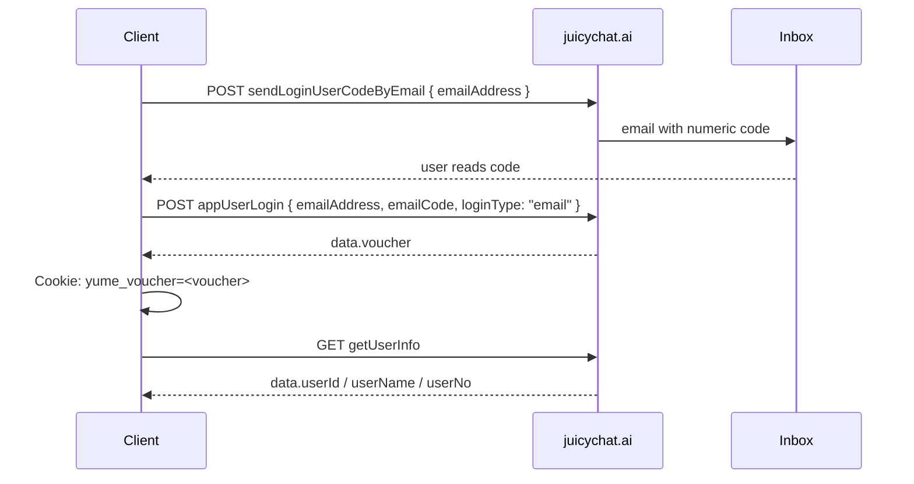
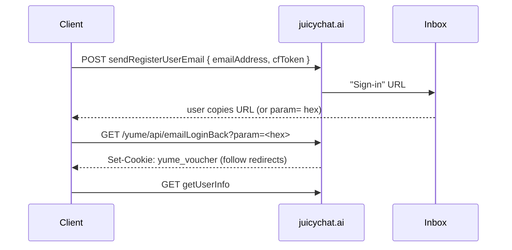

# Juicy Creator OS — API documentation

**Locked:** 2026-08-31  
**This shareable clone is local-only.** Hosted URLs such as `https://juicy-creator-os.vercel.app` refer to the private original, not this repo. Run the lounge on `http://127.0.0.1:8080`.

Do **not** commit `yume_voucher`, magic-link `param` tokens, Google `idToken`s, lounge device tokens, or `data/juicy-session.json`.

Related:

- [`juicychat-yume-api-spec.md`](juicychat-yume-api-spec.md) — Yume transport / envelope (canonical crypto)
- [`juicychat-api.md`](juicychat-api.md) — bot-post operational map

---

## Contents

1. [Two API surfaces](#1-two-api-surfaces)
2. [JuicyChat Yume API](#2-juicychat-yume-api)
   - [2.1 Tech specs](#21-tech-specs)
   - [2.2 Envelope (request / response formatting)](#22-envelope-request--response-formatting)
   - [2.3 How Yume requests are authenticated](#23-how-yume-requests-are-authenticated)
   - [2.4 Login: email OTP](#24-login-email--one-time-code)
   - [2.5 Login: magic link](#25-login-magic-link)
   - [2.6 Other login paths](#26-other-login-paths)
   - [2.7 Endpoint catalog](#27-endpoint-catalog)
3. [Creator OS Lounge API](#3-creator-os-lounge-api)
   - [3.1 How Lounge requests are authenticated](#31-how-lounge-requests-are-authenticated)
   - [3.2 Lounge account login (Better Auth)](#32-lounge-account-login-better-auth)
   - [3.3 Android pairing](#33-android-pairing)
   - [3.4 Lounge endpoints](#34-lounge-endpoints)
4. [Phone proxy (stateless JuicyChat)](#4-phone-proxy-stateless-juicychat)
5. [Cron](#5-cron)
6. [Enums](#6-enums)
7. [Minimal Node client](#7-minimal-node-client)

---

## 1. Two API surfaces

This repo talks to **two** backends. Mixing their cookies is the #1 integration bug.

| Surface | Base | Who it is | Session |
|---|---|---|---|
| **Yume** (JuicyChat product) | `https://www.juicychat.ai` | Official juicychat.ai API used by the lounge scraper, publisher, and phone proxy | Cookie `yume_voucher` |
| **Lounge** (this app) | `https://juicy-creator-os.vercel.app` | Creator OS cloud: dashboard, pairing, scheduled publish, daily pull | Better Auth cookie **or** `x-lounge-device` token |

```
┌─────────────┐   Better Auth / device token    ┌──────────────────────┐
│  Browser /  │ ──────────────────────────────► │ juicy-creator-os     │
│  Android    │                                 │ /api/lounge/*        │
└─────────────┘                                 └──────────┬───────────┘
                                                           │ stored yume_voucher
                                                           ▼
                                                ┌──────────────────────┐
                                                │ www.juicychat.ai     │
                                                │ /yume/api/*          │
                                                └──────────────────────┘
```

Android **never** logs into JuicyChat on the phone for the cloud path. It pairs to a Lounge account; Vercel holds the sealed Yume session. The `/api/phone/*` routes are a separate **stateless** proxy: the cookie travels on each request.

---

## 2. JuicyChat Yume API

Implementation: [`src/lib/juicychat/client.ts`](../src/lib/juicychat/client.ts), [`crypto.ts`](../src/lib/juicychat/crypto.ts).

### 2.1 Tech specs

| | |
|---|---|
| Base URL | `https://www.juicychat.ai` |
| Path prefix | `/yume/api/` |
| TLS | HTTPS only |
| Content-Type | `application/json` (POST) |
| App impersonation | `client: pc`, `platformType: web`, `appVersion: 0.1.67` (lounge) … `0.1.90` (figure bundle). Android publisher uses `0.1.85` / `0.1.86`. |
| Cipher | AES-128-CBC, PKCS#7 |
| Key (16 bytes, public client obfuscation) | `yume1aJ83ZbPpkwb` |
| IV (16 bytes, static) | `yume2024cccydnzc` |
| CharacterWorld images (out of scope) | key `word7Kp2mQx9vRt4` / iv `word2026imgvimgc` |
| Redirects | Client uses `redirect: "manual"` and merges `Set-Cookie` each hop (magic-link redeem, up to 5 hops) |
| Success | HTTP is almost always `200`. Treat as OK when inner `success === true` **or** `code` is `0` / `"0"` / `200` / `"200"` |
| Business errors | Still HTTP 200, e.g. `code: "80002"`, `msg: "Batch size is null!"` |
| Missing paths | HTTP 405 (observed on `exportCharacter`, `getCharacterDefinition`) |

### 2.2 Envelope (request / response formatting)

Almost every **POST** body is **not** the plain JSON. Pipeline (PKCS#7):

```
UTF-8 JSON  →  Base64  →  AES-128-CBC  →  Base64
```

**Request**

```http
POST /yume/api/user/v1/character/getCharacterDetail HTTP/1.1
Host: www.juicychat.ai
Content-Type: application/json

{"requestData":"<ciphertext>"}
```

Empty POST still encrypts `{}`.

**Response** (typical)

```json
{ "responseData": "<ciphertext>" }
```

Decrypt (inverse pipeline) to:

```ts
type JuicyApiResult<T> = {
  code: string;          // "200" | "0" | "80002" | …
  data: T;               // object, array, boolean, or null
  msg?: string;
  success?: boolean;
  total?: number;        // paginated lists
  pageNo?: number;
  pageSize?: number;
  requestId?: string;
};
```

Some endpoints return the inner object **unencrypted**. The lounge client tries `responseData` first, else parses the body as the inner object.

**GET** endpoints (`getUserInfo`, `signOut`, magic-link redeem) send no body. JSON GETs still use the encrypted **response** envelope when present.

Magic-link redeem is a **plain GET** that returns HTML + `Set-Cookie`, not the JSON envelope.

### 2.3 How Yume requests are authenticated

Yume session is a **browser cookie**, not a Bearer token.

| Channel | Name | Role |
|---|---|---|
| **Cookie** | `yume_voucher=<token>` | **The session.** Required for owner lists, publish, creator stats, private bots. |
| Header `SecretKey` | 34-char client id | **Not** the account password. Regenerated per `JuicyClient` unless stored with the session. Format: UUID without dashes + 2 inserted chars (`createJuicySecretKey`). |
| Header `distinctId` | analytics-ish id | `19f` + hex timestamp + random. Stored next to the session. |
| Header `voucher` | lounge sends the string `"null"` | Web bundle also has a `voucher` header. **Cookie is what authenticates.** Some other clients copy `yume_voucher` here; this repo does not. |
| Header `Cookie` | full jar | `yume_voucher` plus any other `Set-Cookie` names absorbed from login redirects. |

`Set-Cookie` on login responses is merged into the in-memory jar ([`mergeCookies`](../src/lib/juicychat/session.ts)). Empty / `deleted` voucher values from 401s are **ignored** unless this is an explicit sign-out (`allowDropVoucher`).

**Unauthenticated** calls still work for public catalog/detail when `publicDefinition` / `visibility` allow it. Without `yume_voucher`, `getOwnUserCharacterList` hides private/unlisted bots.

#### Headers the lounge client always sends

```
Content-Type: application/json
Accept: application/json, text/plain, */*
SecretKey: <34-char>
client: pc
system: windows64
platformType: web
appVersion: 0.1.67
language: en
nsfw: 1
voucher: null
utm_source: null
offsetnumber: 0
navigatorlang: en-US
distinctId: <id>
Origin: https://www.juicychat.ai
Referer: https://www.juicychat.ai/
User-Agent: Mozilla/5.0 (Windows NT 10.0; Win64; x64) AppleWebKit/537.36 (KHTML, like Gecko) Chrome/131.0.0.0 Safari/537.36
Cookie: yume_voucher=<secret>   // omitted when empty
```

Android WebView login captures `CookieManager.getCookie("https://www.juicychat.ai")` once it contains `yume_voucher`.

#### Session object (Creator OS)

Persisted as `data/juicy-session.json` + Postgres `lounge_user_kv` (never in git):

```ts
type JuicySession = {
  cookie: string;       // "yume_voucher=…; …"
  secretKey: string;
  distinctId: string;
  userId?: string;
  userName?: string;
  userNo?: string;
  email?: string;
  loggedInAt?: string;
  source?: "password" | "magic-link" | "manual-cookie" | "google" | "android";
};
```

Verify with `GET /yume/api/user/v1/getUserInfo` → `data.userId`.

---

### 2.4 Login: email + one-time code

This is the **bot-post / figure-generator** default. Two POSTs, both enveloped.



#### Step 1 — request the code

```
POST /yume/api/login/v1/sendLoginUserCodeByEmail
```

Plain payload (then envelope):

```json
{ "emailAddress": "you@example.com" }
```

OK when `success` / `code === "200"` / `data === true`.

**Where the code is:** JuicyChat emails it to `emailAddress`. Check inbox **and spam**. It is a short numeric OTP (typically 6 digits). It expires; request a new one if redeem fails.

No Cloudflare Turnstile token is required on this path (unlike magic link).

#### Step 2 — redeem the code

```
POST /yume/api/login/v1/appUserLogin
```

```json
{
  "emailAddress": "you@example.com",
  "emailCode": "123456",
  "loginType": "email",
  "googleEmail": "",
  "googleName": "",
  "googlePicture": "",
  "discordCode": ""
}
```

On OK, inner `data.voucher` is a string. Lounge does:

```
Cookie: yume_voucher=<data.voucher>
```

then `GET /yume/api/user/v1/getUserInfo`.

Failure: wrong/expired code → `success` false, `msg` from the server. No voucher is written.

#### curl (after encrypting the JSON)

```bash
# 1. send code  — body is { requestData: encrypt('{"emailAddress":"you@example.com"}') }
curl -sS https://www.juicychat.ai/yume/api/login/v1/sendLoginUserCodeByEmail \
  -H 'Content-Type: application/json' \
  -H "SecretKey: $SECRET_KEY" \
  -H 'client: pc' -H 'platformType: web' -H 'appVersion: 0.1.67' \
  --data-binary "$ENVELOPED_SEND"

# 2. wait for the email, then redeem
curl -sS https://www.juicychat.ai/yume/api/login/v1/appUserLogin \
  -H 'Content-Type: application/json' \
  -H "SecretKey: $SECRET_KEY" \
  -H 'client: pc' -H 'platformType: web' -H 'appVersion: 0.1.67' \
  --data-binary "$ENVELOPED_LOGIN"
# decrypt responseData → data.voucher
```

In this repo: `JuicyClient.sendEmailCode()` + `JuicyClient.loginWithEmailCode()`.

---

### 2.5 Login: magic link

Dashboard **Connect JuicyChat source** uses this path (`ConnectSourcePanel` → `requestMagicLink` / `loginWithMagicLink`).



Cloudflare Turnstile site key (login page): `0x4AAAAAABlVjKJdtrV0Ppi0`. When Turnstile cannot render, the official web fallback token is:

```
browser-unsupported-cf-turnstile
```

(`CF_UNSUPPORTED_TOKEN` in [`client.ts`](../src/lib/juicychat/client.ts).)

#### Step 1 — send the link

```
POST /yume/api/login/v1/sendRegisterUserEmail
```

```json
{
  "emailAddress": "you@example.com",
  "cfToken": "browser-unsupported-cf-turnstile"
}
```

OK when `success` / `code === "200"` / `data === true`.

**Where the link is:** JuicyChat emails a **Sign-in** URL to that address. Check inbox **and spam**. The URL looks like:

```
https://www.juicychat.ai/yume/api/emailLoginBack?param=<hex>
```

`param` is hex, typically 16–64 characters. Paste-handlers in this repo also accept:

- the full URL
- a bare hex token
- any string containing `emailLoginBack?param=`

Links expire and are **single-use**. If redeem fails, request a new one.

#### Step 2 — redeem (GET, not enveloped)

```
GET /yume/api/emailLoginBack?param=<hex>
```

- Follow up to 5 redirects (`redirect: "manual"`), merging `Set-Cookie` each hop.
- Success = cookie jar contains `yume_voucher`. Then ping `getUserInfo`.
- This path does **not** return `data.voucher` in JSON; the cookie **is** the credential.
- Failure: expired / already used / HTTP without voucher cookie.

#### curl

```bash
# 1. send (enveloped POST)
curl -sS https://www.juicychat.ai/yume/api/login/v1/sendRegisterUserEmail \
  -H 'Content-Type: application/json' \
  -H "SecretKey: $SECRET_KEY" \
  --data-binary "$ENVELOPED_SEND"

# 2. paste the Sign-in URL from the email
curl -sS -D - -o /dev/null \
  'https://www.juicychat.ai/yume/api/emailLoginBack?param=YOUR_HEX' \
  -H "SecretKey: $SECRET_KEY" \
  -H 'Accept: text/html' \
  --max-redirs 0
# read Set-Cookie: yume_voucher=…
```

In this repo: `JuicyClient.requestMagicLinkEmail()` + `JuicyClient.redeemMagicLink()`. Phone proxy: `POST /api/phone/session` with `action: "magic-send"` then `"magic-redeem"`.

---

### 2.6 Other login paths

All of these still end as `yume_voucher` + `getUserInfo`.

#### Password (`userNo` + password)

```
POST /yume/api/login/v1/userPasswordLogin
```

```json
{ "userNo": "1234567", "password": "…" }
```

Identifier is **`userNo`**, not email. Session arrives via `Set-Cookie` (and possibly `data.voucher`).

#### Google — GIS idToken

```
POST /yume/api/login/v1/googleSignUp
{ "idToken": "<Google ID token>" }
```

#### Google — Android authorization code

| | |
|---|---|
| authorize | `https://accounts.google.com/o/oauth2/v2/auth` |
| `client_id` | `1050354327719-ugsprd667nr00io299kktkipa89ffi44.apps.googleusercontent.com` |
| `redirect_uri` | `https://www.juicychat.ai/yume/api/googleLoginBack` |
| `response_type` | `code` |
| `scope` | `openid email profile` |
| `access_type` | `online` |
| `prompt` | `select_account` |

After redirect onto juicychat.ai (`googleLoginBack`, `googleloginsuccess`, `/home`, …) the WebView cookie jar is read.

#### Manual cookie / Android import

Paste a `Cookie` header that includes `yume_voucher`, or capture it from WebView `CookieManager`. `JuicyClient.importCookie` merges name/value pairs.

#### Sign out

```
GET /yume/api/login/v1/signOut
```

Then drop the local session with `allowDropVoucher`.

---

### 2.7 Endpoint catalog

All **POST** bodies below are the **plain** JSON that is then AES-enveloped. Responses described are the inner `data` unless noted. Auth column: **cookie** = needs `yume_voucher`; **public** = works without (may strip private fields).

#### Login / session

| Method | Path | Auth | Request | Response / effect |
|---|---|---|---|---|
| POST | `/yume/api/login/v1/sendRegisterUserEmail` | public | `{ emailAddress, cfToken }` | send magic link; `data: true` |
| GET | `/yume/api/emailLoginBack?param=` | public | query hex | `Set-Cookie: yume_voucher` (HTML, not envelope) |
| POST | `/yume/api/login/v1/sendLoginUserCodeByEmail` | public | `{ emailAddress }` | send OTP; `data: true` |
| POST | `/yume/api/login/v1/appUserLogin` | public | `{ emailAddress, emailCode, loginType: "email", googleEmail, googleName, googlePicture, discordCode }` | `data.voucher` |
| POST | `/yume/api/login/v1/userPasswordLogin` | public | `{ userNo, password }` | cookie session |
| POST | `/yume/api/login/v1/googleSignUp` | public | `{ idToken }` | cookie session |
| GET | `/yume/api/googleLoginBack` | public | OAuth `code` | cookie session |
| GET | `/yume/api/login/v1/signOut` | cookie | — | invalidate |
| GET | `/yume/api/user/v1/getUserInfo` | cookie | — | see `JuicyUserInfo` below |
| POST | `/yume/api/user/v1/createOauthCode` | cookie | `{ client }` e.g. `characterword` | mapped, unused here |

`getUserInfo` `data`:

```ts
{
  userId: string;
  userName: string;
  userNo?: string;
  userAvatar?: string;
  userBio?: string;
  characterCount?: number;
  chatCount?: number;
  likeCount?: number;
  favoriteCount?: number;
  followersCount?: number;
  followingCount?: number;
  gender?: number;
  medalId?: string[];
  spaceSwitch?: number;
  unfiltered?: number;
}
```

#### Account / creator / social

| Method | Path | Auth | Request | `data` |
|---|---|---|---|---|
| POST | `/yume/api/user/v1/getOtherUserInfo` | public | `{ userId }` | public-ish profile (`JuicyUserInfo`) |
| POST | `/yume/api/user/v1/getUserSpace` | public | `{ userId? }` | space flags / bio |
| POST | `/yume/api/user/v1/getUserStatisticsData` | cookie | `{}` | creator stats |
| POST | `/yume/api/user/v1/getUserInfoCount` | cookie | `{}` | follower/following counts |
| POST | `/yume/api/user/v1/getUserFollowersList` | cookie | `{ pageNo, pageSize }` | follower rows + top-level `total` |
| POST | `/yume/api/user/v1/creator/getBenefitSummary` | cookie | `{}` | gems / benefit |
| POST | `/yume/api/user/v1/creator/ranking/getCreatorRanking` | cookie | ranking payload | leaderboard |
| POST | `/yume/api/user/v1/creator/ranking/getDataCreatorRankingMonthly` | cookie | monthly payload | monthly board |
| POST | `/yume/api/user/v1/message/getMessageList` | cookie | `{ pageNo, pageSize: 100, messageType: 1, actionTypes: number[] }` | notifications + `total` |
| POST | `/yume/api/user/v1/wallet/gemsTransactionRecord` | cookie | `{ pageNo, pageSize }` | gem ledger |
| GET | `/yume/api/user/v1/getLaunchData` | public | — | tag catalogs as JSON strings (`characterTag`, `figureTag`, `pictureTag`, `galleryTag`) |

Notification `actionTypes` used by lounge:

| value | kind |
|---:|---|
| 1 | follow |
| 2 / 4 | favorite |
| 3 / 15 | like |
| 10 / 16 | comment |
| 13 | gift |
| 17 | reward |
| 18 | audit |
| 12 | following (not scraped) |

Lounge default scrape payload:

```json
{
  "pageNo": 1,
  "pageSize": 100,
  "messageType": 1,
  "actionTypes": [1, 2, 3, 4, 10, 13, 15, 16, 17, 18]
}
```

#### Character read

| Method | Path | Auth | Request | Notes |
|---|---|---|---|---|
| POST | `/yume/api/user/v1/character/getOwnUserCharacterList` | cookie | `{ pageNo, pageSize, sortGmtCreate: 0, visibility: null, searchContent: "" }` | **Owner** list including private/unlisted. `data[]` + `total`. Page size 50, max 40 pages. |
| POST | `/yume/api/user/v1/character/getUserSpaceCharacterList` | public | `{ userId, pageNo, pageSize, visibility: null, auditType: null, searchContent: "", characterTags: [], sortName: "new", gender: null }` | public space listing |
| POST | `/yume/api/user/v1/character/getOwnUserCharacterData` | cookie | `{}` | aggregate owner stats |
| POST | `/yume/api/user/v1/character/getCharacterDetail` | mixed | `{ characterId }` | full card for owner; public callers get `setting`/`scenario` null when `publicDefinition=0` |
| POST | `/yume/api/user/v1/character/getCharacterList` | public | `{ pageNo, pageSize, visibility: null, auditType: null, searchContent: "", characterTags: [], sortName, gender: null }` | discovery feeds |
| POST | `/yume/api/user/v1/character/getCharacterListByTag` | public | tag + paging | tag feed |
| POST | `/yume/api/user/v1/character/getCharacterRankingList` | public | `{ pageNo, pageSize, rankingType? }` | ranking (client retries with `rankingType: 1` if first shape fails) |
| POST | `/yume/api/user/v1/character/comment/getCommentPage` | public | `{ characterId, pageNo, pageSize }` | comments + `replyList`, `pinnedTime`, `total` |
| POST | `/yume/api/user/v1/character/picture/getCharacterPictureList` | public | `{ characterId, pageNo, pageSize }` | plaza gallery |

`sortName` values used here: `popular` · `recent` · `trending` · `immersive` · `new` · `editor` · `chatCount`.

**New-feed analytics (Creator OS):** homepage Characters → New is `getCharacterList` with `sortName: "new"`, empty tags, `gender: null`, `visibility: null`, `nsfw: 1`. Dedicated `/new-feed` tab, **manual refresh only** — not a cron source, not Lounge Refresh all. Warehouse file `new-feed.json` (dated lounge-timezone snapshots + accrued catalog). Photos/thumbs are dropped; titles, creator, publish time, tags, and stats are kept. Each New scrape also `GET getLaunchData` and stores `officialTags` / `officialTagsPrev` for event-watch (new official tags on other people's New cards, and tags on New that are not in the catalog yet).

**Dashboard signals (warehouse-derived, no extra scrape):** pond (last 72h `gmtFirstPublish` by tag: n / median / p90 + clone-count of coming-home / argument / home-early), rival 48h velocity (history + MRT, not lifetime chats), own mix heatmap (last 14 ships × gender/rating/top tags), coin field (mapped VIP coins **and leftover unmapped keys** such as Second Best), variety-health (favorites in the last 7 days across ≥3 lanes), event watch (official tag catalog vs New cards). Rebuilt on lounge load from existing files.

**Economy leftover coins:** `getUserVipDetail` + `getUserCoin` map known keys (`coin`, `coinTotal`, `vipCoin`, `vipMaxCoin`, `dailyCoin`, `dailyMaxCoin`, gems…). Every other scalar lands in `vip.leftover` so fields like Second Best stay visible.

List row (`JuicyBot`): `characterId`, `characterName`, `characterPhoto`, `characterThumb`, `introduction`, `chatCount`, `likeCount`, `favoriteCount`, `visibility`, `auditType`, `auditAfterType`, `rating`, `characterTags`, `gender`, `gmtCreate`, `gmtFirstPublish`, `gmtModified`, `score` / `score10` / `score20`, `pinnedTime`, `userId`, `userName`, `personality`, `publicDefinition`, `galleryCount`, `memoryCount`, `genPictureCount`, `figureId`.

Detail extras: `greeting`, `setting`, `scenario`, `characterAge`, `textLength`, `shareCount`, `sceneCard: { pcImage, mobileImage }`, `characterUserInfo`, `borderProp`.

Probed missing (HTTP 405): `exportCharacter`, `getCharacterDefinition`, `getCharacterSetting`.

#### Character write

| Method | Path | Auth | Request | Notes |
|---|---|---|---|---|
| POST | `/yume/api/user/v1/character/createCharacter` | cookie | 5-box + flags | limits: name 40, introduction 500, setting / scenario / greeting 10000 |
| POST | `/yume/api/user/v1/character/updateCharacter` | cookie | same shape | **full replace** — photo-only update wiped a private demo |
| POST | `/yume/api/user/v1/character/userPublishCharacter` | cookie | `{ characterId }` | makes an `auditType=15` bot live (`gmtFirstPublish`). Site toast “Published successfully”. |

5-box → fields:

| Card | API |
|---|---|
| Title | `characterName` |
| Bio | `introduction` |
| Situation | `setting` |
| World / Scene | `scenario` |
| Opening | `greeting` |
| Tags | `characterTags` |
| Photos | `characterPhoto` / `characterThumb` |
| Figure | `figureId` |

bot-post policy in this repo: create at `visibility: 0`, `greeting: null`, `characterTags: []`, never call `userPublishCharacter` from that skill. The Android / lounge publisher **does** call `userPublishCharacter` for `auditType=15` on purpose.

#### Figure / plaza / upload (summary)

| Path | Auth | Role |
|---|---|---|
| POST `/yume/api/user/v1/figure/figureConfig` | cookie | art-style enums + CFG/steps |
| POST `/yume/api/user/v1/figure/generateFigureImage` | cookie | wizard (dropdowns; ignores skill prompts) |
| POST `/yume/api/user/v1/figure/customFigureImage` | cookie | clean mannequin; `appearance`/`clothing`/`action`/`negative` |
| POST `/yume/api/user/v1/figure/figureImageStatus` | cookie | `{ pictureId }` poll: 0 pending, 10 done, 20 fail |
| POST `/yume/api/user/v1/figure/figureDetail` | mixed | `{ figureId }` → `customInfo`, `figureUrl`, `createdType` |
| POST `/yume/api/user/v1/image/queryPicModels` | cookie | plaza models |
| POST `/yume/api/user/v1/image/userGenerateImage` | cookie | `createType: 2` text, `3` figure remix |
| POST `/yume/api/user/v1/image/getUserGenImageStatus` | cookie | `{ pictureId }` |
| POST `/yume/api/user/v1/image/remixPicture` | cookie | exists; plaza button uses `userGenerateImage` |
| POST `/yume/api/user/v1/oss/getS3Sts` | cookie | `{ type: "character" }` → S3 PutObject credentials |

CDN after character upload: `https://cdn.juicychat.ai/${uploadPath}${fileId}.jpg`.

#### Pagination

List endpoints return `data` as an array plus top-level `total`. Stop when `batch.length < pageSize` or `bots.length >= total`.

| API | pageSize | max pages (client) |
|---|---:|---:|
| own / space character list | 50 | 40 |
| discovery `getCharacterList` | 50 | per-feed cap (20–40) |
| followers | 20–50 | until empty |
| notifications | 100 | 150 |
| gallery pictures | 50 | 20 |
| gem ledger | 50 | 5 (insights default) |

---

## 3. Creator OS Lounge API

Base: `https://juicy-creator-os.vercel.app` (local: the app origin). JSON, UTF-8. CORS:

```
Access-Control-Allow-Origin: *
Access-Control-Allow-Methods: GET, POST, DELETE, OPTIONS
Access-Control-Allow-Headers: content-type, authorization, x-lounge-token, x-jl-cookie, x-cron-secret, x-lounge-device, x-lounge-report
```

Successful bodies are JSON `{ ok: true, … }`. Errors `{ ok: false, error?, code?, message? }` with HTTP 400 / 401 / 409 / 500.

Implementation: [`src/routes/api/`](../src/routes/api/), helpers in [`src/lib/juicychat/http.ts`](../src/lib/juicychat/http.ts).

### 3.1 How Lounge requests are authenticated

Lounge auth is **independent** of `yume_voucher`. Three ways to identify a lounge user:

| Mechanism | How | Used by |
|---|---|---|
| **Better Auth session cookie** | `__Host-grok-auth.session_token` (plus optional bearer, see below) | Browser dashboard |
| **Bearer token** | `Authorization: Bearer <token>` — Better Auth `bearer` plugin; live-preview stores it in `sessionStorage` (`grok-auth.bearer-token`) | Preview iframe, some mobile |
| **Device token** | Header `x-lounge-device: <token>` (alias `X-Lounge-Device`) **or** JSON body `{ "deviceToken": "…" }` | Android companion after pairing |

`withResolvedUserStore` ([`identity.ts`](../src/lib/juicychat/identity.ts)):

1. Read Better Auth user from the request.
2. Resolve `x-lounge-device` / `deviceToken` via `lounge_devices`.
3. If both exist and disagree, pick the user that already has lounge data.
4. 401 `"Sign in or pair the Android companion first"` if neither maps.

**Yume cookie is never sent by the browser to `/api/lounge/*`.** It is stored server-side (Postgres `lounge_user_kv` + optional sealed vault cookies `__Host-jl-lv*`) after you connect JuicyChat on the dashboard or after Android pairing uploads a session.

Cron routes use a fourth gate ([`assertCronOrPreview`](../src/lib/juicychat/http.ts)):

- `Authorization: Bearer $CRON_SECRET` or header `x-cron-secret: $CRON_SECRET`
- User-Agent containing `vercel-cron` or `juicylounge-cron`
- Non-Vercel (local / preview) allowed
- Deployed with empty `CRON_SECRET` allowed (so GitHub Actions + dashboard still work)

Report pull can also use `?token=` / header `x-lounge-report` matching the Grok hook `pullToken`.

### 3.2 Lounge account login (Better Auth)

This is the **app** login at `/login` — **not** JuicyChat. Email here is **email + password**, not OTP. OTP / magic link belong to Yume (§2.4 / §2.5).

Catch-all: `GET|POST /api/auth/$` → Better Auth handler ([`src/routes/api/auth/$.ts`](../src/routes/api/auth/$.ts)).

| Method | Path | Body | Notes |
|---|---|---|---|
| POST | `/api/auth/sign-in/email` | `{ email, password }` | existing account |
| POST | `/api/auth/sign-up/email` | `{ email, password, name }` | `password` min 8 chars |
| POST | `/api/auth/sign-out` | — | drop session |
| GET | `/api/auth/get-session` | — | current user |
| POST | `/api/auth/request-password-reset` | `{ email, redirectTo: "/reset-password" }` | email reset |
| POST | `/api/auth/reset-password` | `{ newPassword, token }` | from reset email |
| POST | `/api/auth/sign-in/oauth2` | `{ providerId, callbackURL, errorCallbackURL }` | `grok-google` or `grok-x` via Grok auth broker |

OAuth popup: `/auth/popup?providerId=grok-google&handoff=<uuid>` then callback `/api/auth/callback/grok-google`.

Session cookie: `__Host-grok-auth.session_token`. Live preview also reads `set-auth-token` response header into Bearer.

**How to get a Lounge account**

1. Open `/login`.
2. Continue with Google or X, **or** create email + password (8+).
3. After sign-in, connect JuicyChat on the dashboard (magic link / password / cookie) — that is Yume, stored under this Lounge user.

### 3.3 Android pairing

Pairing binds a phone to a Lounge user **without** giving the phone JuicyChat credentials.

```
Browser (signed in)          Phone
   │                           │
   │ POST /api/lounge/pair     │
   │ { }  → { pair: { code, expiresAt } }
   │                           │
   │         15 min code       │
   │         ABCD-EFGH         │
   │ ─────────────────────────►│
   │                           │ POST /api/lounge/pair
   │                           │ { action: "redeem", code, session? }
   │                           │ ← { deviceToken, userId }
   │                           │
   │                    later: x-lounge-device: <deviceToken>
```

- Code format: `XXXX-XXXX` from alphabet `ABCDEFGHJKLMNPQRSTUVWXYZ23456789`, 15 minutes, single-use.
- Redeem may also upload a `JuicySession` (cookie) so the cloud has a Yume source.
- Keep `deviceToken` on the phone; it is the Android auth secret.

### 3.4 Lounge endpoints

Unless noted, all require Lounge auth (§3.1). OPTIONS returns 204 CORS.

#### `GET /api/health` — public

No auth. Probe DB + auth config.

```json
{
  "ok": true,
  "db": "neon" | "pglite",
  "databaseUrl": true,
  "latencyMs": 12,
  "schema": true,
  "schemaSolid": true,
  "grokAuth": true,
  "grokClient": "app" | "preview" | "preview-blocked",
  "authUsers": 1,
  "durable": true
}
```

#### `GET /api/download-apk` — public

Streams `juicy-lounge-debug.apk` (`application/vnd.android.package-archive`) or 302 to `/downloads/juicy-lounge-debug.apk`.

#### `GET /api/lounge/link`

Cheap companion ping.

- Header `x-lounge-device` **or** `?deviceToken=`
- `200 { ok, linked: true, code: "LINKED", userId }`
- `401 { code: "NO_TOKEN" | "UNPAIRED" }`

#### `GET /api/lounge/pair`

Signed-in browser only. Returns current unused code if any:

```json
{ "ok": true, "userId": "…", "email": "…", "pair": { "code": "ABCD-EFGH", "expiresAt": "…" } | null }
```

#### `POST /api/lounge/pair`

```json
{ "action": "mint" }
```

→ `{ ok, pair: { code, expiresAt }, userId }` (browser session required)

```json
{ "action": "redeem", "code": "ABCD-EFGH", "session": { "cookie": "yume_voucher=…", "secretKey": "…", "distinctId": "…" } }
```

→ `{ ok, linked: true, code: "LINKED", userId, deviceToken }`

#### `POST /api/lounge/session`

Upload / refresh the stored Yume session for this lounge user.

```json
{
  "session": {
    "cookie": "yume_voucher=…",
    "secretKey": "…",
    "distinctId": "…",
    "userId": "…",
    "userName": "…",
    "source": "android"
  },
  "deviceToken": "…"
}
```

The body may also be the session object itself. `400` if no `cookie`.

#### `GET /api/lounge/status`

Cloud pull status + scheduled jobs.

```json
{
  "ok": true,
  "linked": true,
  "code": "LINKED",
  "jobs": [],
  "scheduled": 0
}
```

(plus fields from `getCloudStatus()`)

#### `GET /api/lounge/dashboard`

Cached dashboard, widget numbers, Yume-session flag, Grok hook public view, persist health.

```json
{
  "ok": true,
  "linked": true,
  "code": "LINKED",
  "dashboard": { "snapshot": {}, "growth": {}, "scrapedAt": "…" },
  "widget": {
    "userName": "",
    "userId": "",
    "bots": 0,
    "chats": 0,
    "likes": 0,
    "favorites": 0,
    "followers": 0,
    "interactions": 0,
    "chatsDelta": 0,
    "likesDelta": 0,
    "scrapedAt": null,
    "source": "cache"
  },
  "status": { "jobs": [], "scheduled": 0 },
  "hasJuicySession": true,
  "juicyUser": "SampleCreator",
  "grok": {},
  "persist": {}
}
```

#### `POST /api/lounge/refresh`

Run a daily pull now (needs a stored Yume session).

```json
{ "deviceToken": "…" }
```

- `200 { ok, code: "PULLED", message, details, dashboard, persist, widget }`
- `409 { ok: false, code: "NO_SOURCE", message }` — JuicyChat not connected on this account
- `401 { code: "UNPAIRED" }`

`maxDuration` 60s.

#### `POST /api/lounge/publish`

Publish `auditType=15` bots via Yume `userPublishCharacter`.

```json
{ "characterIds": ["2093…"], "session": { "cookie": "…" }, "deviceToken": "…" }
```

Optional `session` is saved first. `400` if no ids.

#### `GET /api/lounge/schedule`

`{ ok, jobs: CloudJob[] }`

#### `POST /api/lounge/schedule`

```json
{
  "characterId": "2093…",
  "characterName": "Pip",
  "fireAtMs": 1756620000000,
  "session": { "cookie": "…" },
  "deviceToken": "…"
}
```

→ `{ ok, job }`

#### `DELETE /api/lounge/schedule?id=<jobId>`

→ `{ ok: true|false }`

#### `GET /api/lounge/hook`

Public Grok-webhook view (URL, enabled, rotated flags — not the raw secret unless just rotated).

#### `POST /api/lounge/hook`

```json
{
  "url": "https://…",
  "enabled": true,
  "secret": "optional-override",
  "rotateSecret": false,
  "rotatePullToken": false,
  "test": false
}
```

#### `GET /api/lounge/report`

Latest lounge report JSON for Grok.

Auth: `?token=<pullToken>` or header `x-lounge-report`, else normal lounge auth.

→ `{ ok, code: "REPORT", report }`

#### `POST /api/lounge/restore`

Upload a lounge backup JSON (optionally `{ backup: { … } }`). Applies snapshot + `publishJobs`.

---

## 4. Phone proxy (stateless JuicyChat)

These routes **do not** use Lounge device tokens. They take a Yume cookie per call (`body.cookie` or header `x-jl-cookie`) and talk to juicychat.ai. They never write Better Auth / `lounge_user_kv`.

Implementation: [`src/lib/juicychat/phone-auth.ts`](../src/lib/juicychat/phone-auth.ts).

### `POST /api/phone/session`

| `action` | Body | Effect |
|---|---|---|
| `password` | `{ userNo, password, email? }` | Yume password login |
| `magic-send` | `{ email, cfToken? }` | send magic link to that inbox |
| `magic-redeem` | `{ link, email? }` | redeem Sign-in URL / hex `param` |
| `cookie` | `{ cookie }` or header `x-jl-cookie` | import cookie |
| `google-cookie` | same | import, `source: "google"` |
| `me` (default) | cookie | ping `getUserInfo` |

Success:

```json
{
  "ok": true,
  "message": "Logged in as @name.",
  "session": {
    "cookie": "yume_voucher=…",
    "secretKey": "…",
    "distinctId": "…",
    "userId": "…",
    "userName": "…",
    "userNo": "…",
    "email": "",
    "source": "magic-link",
    "loggedInAt": "2026-08-31T12:00:00.000Z"
  }
}
```

**Getting a magic link from the phone API**

```bash
curl -sS https://juicy-creator-os.vercel.app/api/phone/session \
  -H 'Content-Type: application/json' \
  -d '{"action":"magic-send","email":"you@example.com"}'
# → { "ok": true, "message": "Magic link sent to you@example.com. …" }

# From the email, paste the Sign-in URL:
curl -sS https://juicy-creator-os.vercel.app/api/phone/session \
  -H 'Content-Type: application/json' \
  -d '{"action":"magic-redeem","email":"you@example.com","link":"https://www.juicychat.ai/yume/api/emailLoginBack?param=abc…"}'
```

Email OTP is **not** wrapped on `/api/phone/session` today — call Yume directly (§2.4) or use `JuicyClient.loginWithEmailCode`.

### `POST /api/phone/queue`

```json
{ "cookie": "yume_voucher=…" }
```

→ `{ ok, queue, user, session? }` — pending `auditType` 10/15/20 bots.

### `POST /api/phone/publish`

```json
{ "cookie": "yume_voucher=…", "characterIds": ["2093…"] }
```

→ `{ ok, results: [{ characterId, characterName, ok, message }], queue, user, session? }`

---

## 5. Cron

Auth: §3.1 cron gate.

| Method | Path | Schedule (UTC, `vercel.json`) | Does |
|---|---|---|---|
| GET/POST | `/api/cron/pull` | named jobs in the lounge timezone (default 05:00 / 23:55) | `runDailyPullAllAccounts` |
| GET/POST | `/api/cron/publish` | not in `vercel.json` (GitHub Action / dashboard) | `runDuePublishesOnly` |

```bash
curl -sS https://juicy-creator-os.vercel.app/api/cron/pull \
  -H "Authorization: Bearer $CRON_SECRET"
```

---

## 6. Enums

### visibility

| value | label |
|---:|---|
| 0 | private (owner-only) |
| 1 | unlisted (link) |
| 2 | public (feed) |

No draft enum. Closest: `visibility = 0` and `gmtFirstPublish == null`.

### publicDefinition

| 0 | 1 |
|---|---|
| `setting` / `scenario` stripped on public `getCharacterDetail` | definition public |

### rating

| 0 | 1 | 2 |
|---|---|---|
| SFW | NSFW | 18+ |

### gender (character)

| 0 | 1 | 2 | 3 | 4 |
|---|---|---|---|---|
| Female | Male | Non-binary | Male (FTM) | Female (MTF) |

Figure APIs often send gender as the **string** `"0"`.

### auditType (list/detail; not set by create)

| value | label | publish? |
|---:|---|---|
| 0 | live / idle | already public, or never submitted |
| 10 | under review | no |
| 15 | pending release (approved, waiting) | **only** `userPublishCharacter` |
| 20 | rejected | no |

---

## 7. Minimal Node client

```js
import { createCipheriv, createDecipheriv, randomUUID } from "node:crypto";

const KEY = Buffer.from("yume1aJ83ZbPpkwb", "utf8");
const IV = Buffer.from("yume2024cccydnzc", "utf8");
const BASE = "https://www.juicychat.ai";

function encrypt(plain) {
  const b64 = Buffer.from(plain, "utf8").toString("base64");
  const cipher = createCipheriv("aes-128-cbc", KEY, IV);
  return Buffer.concat([cipher.update(b64, "utf8"), cipher.final()]).toString("base64");
}
function decrypt(b64) {
  const decipher = createDecipheriv("aes-128-cbc", KEY, IV);
  const dec = Buffer.concat([
    decipher.update(Buffer.from(b64, "base64")),
    decipher.final(),
  ]).toString("utf8");
  return Buffer.from(dec, "base64").toString("utf8");
}
function secretKey() {
  const base = randomUUID().replace(/-/g, "").split("");
  base.splice(5, 0, "m");
  base.splice(10, 0, "4");
  return base.join("");
}

async function post(path, data, cookie = "") {
  const res = await fetch(`${BASE}${path}`, {
    method: "POST",
    headers: {
      "content-type": "application/json",
      SecretKey: secretKey(),
      client: "pc",
      platformType: "web",
      appVersion: "0.1.67",
      Origin: BASE,
      Referer: `${BASE}/`,
      ...(cookie ? { Cookie: cookie } : {}),
    },
    body: JSON.stringify({ requestData: encrypt(JSON.stringify(data ?? {})) }),
  });
  const json = await res.json();
  return json.responseData ? JSON.parse(decrypt(json.responseData)) : json;
}

// Email OTP:
// await post("/yume/api/login/v1/sendLoginUserCodeByEmail", { emailAddress });
// const r = await post("/yume/api/login/v1/appUserLogin", {
//   emailAddress, emailCode, loginType: "email",
//   googleEmail: "", googleName: "", googlePicture: "", discordCode: "",
// });
// const cookie = `yume_voucher=${r.data.voucher}`;
```

Prefer `JuicyClient` in this repo — it already merges cookies, SecretKey, and both login flows.

---

## What must not live in git

| May live in git | Must not |
|---|---|
| AES key/IV (public obfuscation) | `yume_voucher` / session cookie |
| Endpoint paths, enums, field limits | JWT / magic-link `param` / email OTP |
| characterIds, visibility, auditType | Lounge `deviceToken`, pair codes in use |
| This document | `/workspace/data/juicy-session.json`, `.env` |
