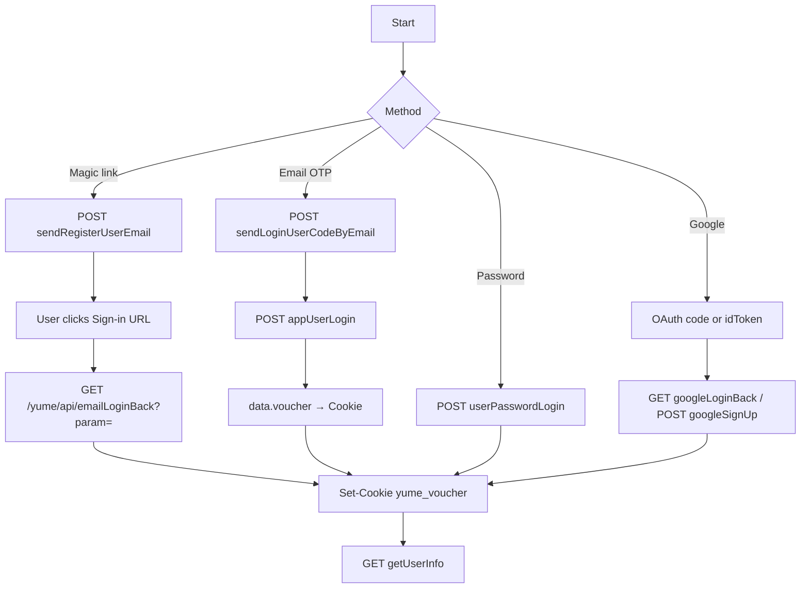

# JuicyChat Yume API — technical specification

**Status:** discovered / live-tested in Juicy Creator OS (`src/lib/juicychat/*`, Android publisher, dump scripts).
**Locked:** 2026-08-31
**Base URL:** `https://www.juicychat.ai`
**Product surface:** web `appVersion` `0.1.67` (lounge client) … `0.1.90` (figure generator bundle)
**This is not a licence to scrape, publish, or impersonate other creators.**

**Canonical API reference (endpoints, auth, email OTP / magic-link login):** [`API.md`](API.md). This file is the transport / envelope spec.

---

Do **not** commit `yume_voucher`, magic-link `param` tokens, Google `idToken`s, or `/workspace/data/juicy-session.json`.

---

## 1. Transport

Every JSON call is HTTPS to `www.juicychat.ai`. Paths live under `/yume/api/`.

| Kind | HTTP | Body |
|---|---|---|
| Almost all business APIs | `POST` | encrypted envelope (below) |
| Session ping, sign-out, magic-link redeem, some catalogs | `GET` | empty; same encrypted **response** envelope when JSON |

`/chat/{id}` in the browser **is** `characterId`. There is no separate chat-export API.

### 1.1 Request envelope

Plain JSON is **not** sent raw (except the magic-link GET). POST bodies are:

```json
{ "requestData": "<ciphertext>" }
```

Pipeline (PKCS#7 padding):

```
UTF-8 JSON  →  Base64  →  AES-128-CBC  →  Base64
```

| | value | notes |
|---|---|---|
| algorithm | AES-128-CBC | Node `createCipheriv("aes-128-cbc", KEY, IV)` |
| key | `yume1aJ83ZbPpkwb` | 16 bytes, **public client obfuscation** |
| iv | `yume2024cccydnzc` | 16 bytes, static |
| CharacterWorld images (out of scope) | key `word7Kp2mQx9vRt4` / iv `word2026imgvimgc` | different product |

Implementation: [`src/lib/juicychat/crypto.ts`](../src/lib/juicychat/crypto.ts).

Empty POST body still encrypts `{}`.

### 1.2 Response envelope

Typical wire JSON:

```json
{ "responseData": "<ciphertext>" }
```

Decrypt with the inverse pipeline (Base64 → AES-128-CBC → Base64 → UTF-8 JSON).

Some endpoints return the inner object **unencrypted**. The lounge client tries `responseData` first, else parses the body as the inner object.

Inner object:

```ts
type JuicyApiResult<T> = {
  code: string;          // "200" | "0" | "80002" | …
  data: T;               // payload, array, boolean, or null
  msg?: string;
  success?: boolean;
  total?: number;        // paginated lists
  pageNo?: number;
  pageSize?: number;
  requestId?: string;
};
```

Treat as **OK** when `success === true` **or** `code` is `0` / `"0"` / `200` / `"200"`.

Business errors still HTTP 200 with `code` like `80002` (“Batch size is null!”) and a `msg`. HTTP 405 was observed on non-existent definition-export paths.

---

## 2. How authentication is passed

JuicyChat session is a **browser cookie**, not a Bearer token.

| Channel | Name | Role |
|---|---|---|
| **Cookie** | `yume_voucher=<token>` | **the session.** Required for owner lists, publish, creator stats, private bots. |
| Header `SecretKey` | 34-char client id | **Not** the account password. Regenerated per `JuicyClient` unless stored with the session. Format: UUID without dashes + 2 inserted chars (`crypto.createJuicySecretKey`). |
| Header `distinctId` | analytics-ish id | `19f` + hex timestamp + random. Stored next to the session. |
| Header `voucher` | lounge sends the **string** `"null"` | Web bundle also has a `voucher` header. Cookie is what actually authenticates. Some other clients copy `yume_voucher` here; we do not. |
| Header `Cookie` | full cookie jar | `yume_voucher` plus any other `Set-Cookie` names absorbed from login redirects. |

`Set-Cookie` on login responses is merged into the in-memory jar ([`mergeCookies`](../src/lib/juicychat/session.ts)). Empty / `deleted` voucher values from 401s are **ignored** unless this is an explicit sign-out (`allowDropVoucher`).

**Unauthenticated** calls still work for public catalog/detail when `publicDefinition` / `visibility` allow it. Without `yume_voucher`, `getOwnUserCharacterList` hides private/unlisted bots.

### 2.1 Headers the lounge client always sends

```
Content-Type: application/json
Accept: application/json, text/plain, */*
SecretKey: <34-char>
client: pc
system: windows64
platformType: web
appVersion: 0.1.67
language: en
nsfw: 1
voucher: null
utm_source: null
offsetnumber: 0
navigatorlang: en-US
distinctId: <id>
Origin: https://www.juicychat.ai
Referer: https://www.juicychat.ai/
User-Agent: Mozilla/5.0 (Windows NT 10.0; Win64; x64) AppleWebKit/537.36 (KHTML, like Gecko) Chrome/131.0.0.0 Safari/537.36
Cookie: yume_voucher=<secret>   // omitted when empty
```

Android WebView login captures `CookieManager.getCookie("https://www.juicychat.ai")` once it contains `yume_voucher`.

### 2.2 Session object (Creator OS)

Persisted as `data/juicy-session.json` + Postgres `lounge_user_kv` (never in git):

```ts
type JuicySession = {
  cookie: string;       // "yume_voucher=…; …"
  secretKey: string;
  distinctId: string;
  userId?: string;
  userName?: string;
  userNo?: string;
  email?: string;
  loggedInAt?: string;
  source?: "password" | "magic-link" | "manual-cookie" | "google" | "android";
};
```

Verify with `GET /yume/api/user/v1/getUserInfo` → `data.userId`.

---

## 3. Authentication flows

Four login paths are implemented. All end the same way: a `yume_voucher` cookie + `getUserInfo`.



Cloudflare Turnstile site key (login page): `0x4AAAAAABlVjKJdtrV0Ppi0`. When Turnstile cannot render, the official web fallback token is:

```
browser-unsupported-cf-turnstile
```

(`CF_UNSUPPORTED_TOKEN` in [`client.ts`](../src/lib/juicychat/client.ts).)

### 3.1 Magic link (email Sign-in URL)

**Send**

```
POST /yume/api/login/v1/sendRegisterUserEmail
```

Plain payload (then envelope):

```json
{
  "emailAddress": "user@example.com",
  "cfToken": "browser-unsupported-cf-turnstile"
}
```

OK when `success` / `code === "200"` / `data === true`. Inbox contains a **Sign-in** URL.

**Redeem**

```
GET /yume/api/emailLoginBack?param=<hex>
```

- `param` is hex, typically 16–64 chars.
- Paste-handlers in this repo also accept a bare hex token or extract `emailLoginBack?param=` from a full URL.
- Request is **GET, not enveloped**. Follow up to 5 redirects (`redirect: "manual"`), merging `Set-Cookie` each hop.
- Success = jar contains `yume_voucher`. Then ping `getUserInfo`.
- Failure: expired / already used / HTTP without voucher cookie.

This path does **not** return `data.voucher` in JSON; the cookie is the credential.

### 3.2 Email one-time code (OTP)

**Send code**

```
POST /yume/api/login/v1/sendLoginUserCodeByEmail
```

```json
{ "emailAddress": "user@example.com" }
```

**Redeem code**

```
POST /yume/api/login/v1/appUserLogin
```

```json
{
  "emailAddress": "user@example.com",
  "emailCode": "123456",
  "loginType": "email",
  "googleEmail": "",
  "googleName": "",
  "googlePicture": "",
  "discordCode": ""
}
```

On OK, inner `data.voucher` is a string. Lounge does:

```
Cookie: yume_voucher=<data.voucher>
```

then `GET getUserInfo`.

This is the **bot-post / figure-generator** default login (email + OTP).

### 3.3 Password (`userNo` + password)

```
POST /yume/api/login/v1/userPasswordLogin
```

```json
{
  "userNo": "1234567",
  "password": "…"
}
```

Identifier is **`userNo`**, not email. Session arrives via `Set-Cookie` (and possibly `data.voucher`). Then `getUserInfo`.

### 3.4 Google

**Web / GIS**

```
POST /yume/api/login/v1/googleSignUp
{ "idToken": "<Google ID token>" }
```

**Android overlay (authorization code)**

Google OAuth v2 in a WebView:

| | |
|---|---|
| authorize | `https://accounts.google.com/o/oauth2/v2/auth` |
| `client_id` | `1050354327719-ugsprd667nr00io299kktkipa89ffi44.apps.googleusercontent.com` |
| `redirect_uri` | `https://www.juicychat.ai/yume/api/googleLoginBack` |
| `response_type` | `code` |
| `scope` | `openid email profile` |
| `access_type` | `online` |
| `prompt` | `select_account` |

After redirect onto juicychat.ai (`googleLoginBack`, `googleloginsuccess`, `/home`, …) the WebView cookie jar is read. Credential is again `yume_voucher`.

### 3.5 Manual cookie / Android import

Paste a `Cookie` header (must include `yume_voucher`) or capture it from WebView `CookieManager`. `JuicyClient.importCookie` merges name/value pairs.

### 3.6 Sign out

```
GET /yume/api/login/v1/signOut
```

Then drop the local session with `allowDropVoucher`.

---

## 4. Enums (observed)

### visibility

| value | label |
|---:|---|
| 0 | private (owner-only) |
| 1 | unlisted (link) |
| 2 | public (feed) |

There is **no draft enum**. Closest: `visibility = 0` and `gmtFirstPublish == null`.

### publicDefinition

| value | meaning |
|---:|---|
| 0 | `setting` / `scenario` (Situation + World) **stripped** on public `getCharacterDetail` |
| 1 | definition public |

Live example (2026-08-30): character `2093538151023353858` (`- You Were Good To Me -`) had `publicDefinition: 0`, `setting`/`scenario` `null`, `textLength: 8233` vs greeting 3050 + bio 465. No public `exportCharacter` / `getCharacterDefinition` (HTTP 405).

### rating

| 0 | 1 | 2 |
|---|---|---|
| SFW | NSFW | 18+ |

### gender (character)

| 0 | 1 | 2 | 3 | 4 |
|---|---|---|---|---|
| Female | Male | Non-binary | Male (FTM) | Female (MTF) |

Figure APIs often send gender as the **string** `"0"`.

### auditType (list/detail; not set by create)

| value | label | publish? |
|---:|---|---|
| 0 | live / idle | already public, or never submitted |
| 10 | under review | no |
| 15 | pending release (approved, waiting) | **only** `userPublishCharacter` |
| 20 | rejected | no |

`gmtFirstPublish` empty ⇒ never gone live. Lounge calls that a draft when audit is also 0.

---

## 5. Endpoint catalog

All `POST` bodies below are the **plain** JSON that is then AES-enveloped. Responses are the inner `data` unless noted.

### 5.1 Login / session

| Method | Path | Request | Response / effect |
|---|---|---|---|
| POST | `/yume/api/login/v1/sendRegisterUserEmail` | `{ emailAddress, cfToken }` | send magic link |
| GET | `/yume/api/emailLoginBack?param=` | query hex | `Set-Cookie: yume_voucher` |
| POST | `/yume/api/login/v1/sendLoginUserCodeByEmail` | `{ emailAddress }` | send OTP |
| POST | `/yume/api/login/v1/appUserLogin` | `{ emailAddress, emailCode, loginType: "email", … }` | `data.voucher` |
| POST | `/yume/api/login/v1/userPasswordLogin` | `{ userNo, password }` | cookie session |
| POST | `/yume/api/login/v1/googleSignUp` | `{ idToken }` | cookie session |
| GET | `/yume/api/googleLoginBack` | OAuth `code` | cookie session |
| GET | `/yume/api/login/v1/signOut` | — | invalidate |
| GET | `/yume/api/user/v1/getUserInfo` | — | `data`: `userId`, `userName`, `userNo`, avatar, counts |
| POST | `/yume/api/user/v1/createOauthCode` | `{ client }` e.g. `characterword` | mapped, unused here |

### 5.2 Account / creator / social

| Method | Path | Request | `data` |
|---|---|---|---|
| POST | `/yume/api/user/v1/getOtherUserInfo` | `{ userId }` | public-ish profile |
| POST | `/yume/api/user/v1/getUserSpace` | `{ userId? }` | space flags / bio |
| POST | `/yume/api/user/v1/getUserStatisticsData` | `{}` | creator stats |
| POST | `/yume/api/user/v1/getUserInfoCount` | `{}` | follower/following counts |
| POST | `/yume/api/user/v1/getUserFollowersList` | `{ pageNo, pageSize }` | follower rows + `total` |
| POST | `/yume/api/user/v1/creator/getBenefitSummary` | `{}` | gems / benefit |
| POST | `/yume/api/user/v1/creator/ranking/getCreatorRanking` | ranking payload | leaderboard |
| POST | `/yume/api/user/v1/creator/ranking/getDataCreatorRankingMonthly` | monthly payload | monthly board |
| POST | `/yume/api/user/v1/message/getMessageList` | `{ pageNo, pageSize: 100, messageType: 1, actionTypes: number[] }` | notifications |
| POST | `/yume/api/user/v1/wallet/gemsTransactionRecord` | `{ pageNo, pageSize }` | gem ledger |
| GET | `/yume/api/user/v1/getLaunchData` | — | tag catalogs as JSON strings (`characterTag`, `figureTag`, …) |

### 5.3 Character read

| Method | Path | Request | Notes |
|---|---|---|---|
| POST | `/yume/api/user/v1/character/getOwnUserCharacterList` | `{ pageNo, pageSize, sortGmtCreate: 0, visibility: null, searchContent: "" }` | **owner** list including private/unlisted. `data[]` + `total`. Page size 50 in this repo. |
| POST | `/yume/api/user/v1/character/getUserSpaceCharacterList` | `{ userId, pageNo, pageSize }` | public space listing |
| POST | `/yume/api/user/v1/character/getOwnUserCharacterData` | `{}` | aggregate owner stats |
| POST | `/yume/api/user/v1/character/getCharacterDetail` | `{ characterId }` | full card for owner; public callers get `setting`/`scenario` null when `publicDefinition=0` |
| POST | `/yume/api/user/v1/character/getCharacterList` | `{ pageNo, pageSize, visibility: null, auditType: null, searchContent: "", characterTags: [], sortName, gender: null }` | discovery feeds (`sortName` = popular / trending / immersive / recent / editor) |
| POST | `/yume/api/user/v1/character/getCharacterListByTag` | tag + paging | tag feed |
| POST | `/yume/api/user/v1/character/getCharacterRankingList` | `{ pageNo, pageSize, rankingType? }` | ranking |
| POST | `/yume/api/user/v1/character/comment/getCommentPage` | `{ characterId, pageNo, pageSize }` | comments + `replyList`, `pinnedTime` |
| POST | `/yume/api/user/v1/character/picture/getCharacterPictureList` | `{ characterId, pageNo, pageSize }` | plaza gallery. `promptPublic: 0` still returned `inputContent` / `imagePrompt` on a 2026-08-30 public pull |

**List row (`JuicyBot`) fields used here:** `characterId`, `characterName`, `characterPhoto`, `characterThumb`, `introduction`, `chatCount`, `likeCount`, `favoriteCount`, `visibility`, `auditType`, `auditAfterType`, `rating`, `characterTags`, `gender`, `gmtCreate`, `gmtFirstPublish`, `gmtModified`, `score` / `score10` / `score20`, `pinnedTime`, `userId`, `userName`, `personality`, `publicDefinition`, `galleryCount`, `memoryCount`, `genPictureCount`, `figureId`.

**Detail extras:** `greeting`, `setting`, `scenario`, `characterAge`, `textLength`, `shareCount`, `sceneCard: { pcImage, mobileImage }`, `characterUserInfo`, `borderProp` (storefront).

Probed missing (HTTP 405): `exportCharacter`, `getCharacterDefinition`, `getCharacterSetting`.

### 5.4 Character write

| Method | Path | Request | Notes |
|---|---|---|---|
| POST | `/yume/api/user/v1/character/createCharacter` | 5-box + flags | field limits: name 40, introduction 500, setting / scenario / greeting 10000 |
| POST | `/yume/api/user/v1/character/updateCharacter` | same shape | **full replace** — photo-only update wiped a private demo |
| POST | `/yume/api/user/v1/character/userPublishCharacter` | `{ characterId }` | makes an `auditType=15` bot live (`gmtFirstPublish`). Site toast “Published successfully”. |

5-box → fields:

| Card | API |
|---|---|
| Title | `characterName` |
| Bio | `introduction` |
| Situation | `setting` |
| World / Scene | `scenario` |
| Opening | `greeting` |
| Tags | `characterTags` |
| Photos | `characterPhoto` / `characterThumb` |
| Figure | `figureId` |

bot-post policy in this repo: create at `visibility: 0`, `greeting: null`, `characterTags: []`, never call `userPublishCharacter` from that skill. The Android publisher **does** call `userPublishCharacter` for `auditType=15` on purpose.

### 5.5 Figure / plaza / upload (summary)

Full payloads: [`juicychat-figure-api.md`](juicychat-figure-api.md).

| Path | Role |
|---|---|
| POST `/yume/api/user/v1/figure/figureConfig` | art-style enums + CFG/steps |
| POST `/yume/api/user/v1/figure/generateFigureImage` | wizard (dropdowns; ignores skill prompts) |
| POST `/yume/api/user/v1/figure/customFigureImage` | clean mannequin; `appearance`/`clothing`/`action`/`negative` |
| POST `/yume/api/user/v1/figure/figureImageStatus` | `{ pictureId }` poll: 0 pending, 10 done, 20 fail |
| POST `/yume/api/user/v1/figure/figureDetail` | `{ figureId }` → `customInfo`, `figureUrl`, `createdType` |
| POST `/yume/api/user/v1/image/queryPicModels` | plaza models (same `enumValue`s) |
| POST `/yume/api/user/v1/image/userGenerateImage` | `createType: 2` text, `3` figure remix |
| POST `/yume/api/user/v1/image/getUserGenImageStatus` | `{ pictureId }` |
| POST `/yume/api/user/v1/image/remixPicture` | exists; plaza button uses `userGenerateImage` |
| POST `/yume/api/user/v1/oss/getS3Sts` | `{ type: "character" }` → S3 PutObject credentials |

CDN URL after character upload:

```
https://cdn.juicychat.ai/${uploadPath}${fileId}.jpg
```

Figure JPEGs: `https://cdn.juicychat.ai/user/prod/{figureId|pictureId}/{hash}.jpg`.

**Never** from bot-post: `publishFigure`, `userPublishCharacter`.

Working figureDetail path in lounge: `/yume/api/user/v1/figure/figureDetail`. Dump script also probed `/character/figure/getFigureDetail` and `/figure/getFigureDetail`.

---

## 6. Pagination

List endpoints return `data` as an array plus top-level `total`.

Lounge defaults:

| API | pageSize | max pages (client) |
|---|---:|---:|
| own / space character list | 50 | 40 |
| discovery `getCharacterList` | 50 | per-feed cap |
| followers | 20–50 | until empty |
| notifications | 100 | 150 |
| gallery pictures | 50 | 20 |
| gem ledger | typical 20–50 | — |

Stop when `batch.length < pageSize` or `bots.length >= total`.

---

## 7. Public vs owner (read)

| Need | Auth | Endpoint |
|---|---|---|
| Public card (bio, greeting, stats, tags, photos) | optional | `getCharacterDetail` |
| Situation / World when `publicDefinition=0` | **owner session** | same, as owner |
| Private / unlisted bots | owner cookie | `getOwnUserCharacterList` |
| Public space grid | optional | `getUserSpaceCharacterList` |
| Figure prompts (`customInfo`) | often public | `figureDetail` |
| Gallery prompts | often public even if `promptPublic=0` | `getCharacterPictureList` |
| Comments | public | `getCommentPage` |

`/chat/{characterId}` HTML is not a JSON export. Use the APIs.

---

## 8. Implementation map (this repo)

| Layer | File |
|---|---|
| Envelope + headers + login | [`src/lib/juicychat/client.ts`](../src/lib/juicychat/client.ts) |
| AES + SecretKey | [`src/lib/juicychat/crypto.ts`](../src/lib/juicychat/crypto.ts) |
| Cookie merge + session file | [`src/lib/juicychat/session.ts`](../src/lib/juicychat/session.ts) |
| Phone/APK auth (stateless) | [`src/lib/juicychat/phone-auth.ts`](../src/lib/juicychat/phone-auth.ts) |
| Owner scrape | [`src/lib/juicychat/scrape.ts`](../src/lib/juicychat/scrape.ts) |
| Publish `auditType=15` | [`src/lib/juicychat/publish-bots.ts`](../src/lib/juicychat/publish-bots.ts) |
| Google WebView | [`android/.../GoogleLoginOverlay.java`](../android/app/src/main/java/ai/juicylounge/analytics/GoogleLoginOverlay.java) |
| Headless publish | [`android/.../HeadlessPublish.java`](../android/app/src/main/java/ai/juicylounge/analytics/HeadlessPublish.java) |
| Dump script | [`scripts/dump-live-bots.mjs`](../scripts/dump-live-bots.mjs) |
| OAuth / Turnstile constants | [`src/lib/juicychat/constants.ts`](../src/lib/juicychat/constants.ts) |

---

## 9. Minimal authenticated POST (reference)

```js
// 1. encrypt JSON.stringify(payload) with AES-128-CBC key/iv above
// 2. POST { requestData } with Cookie: yume_voucher=… and SecretKey
// 3. decrypt responseData
await client.post("/yume/api/user/v1/character/getCharacterDetail", {
  characterId: "2093538151023353858",
});
```

Unauthenticated, that call still returns the public card. `setting` / `scenario` stay `null` unless you own the bot or `publicDefinition=1`.
